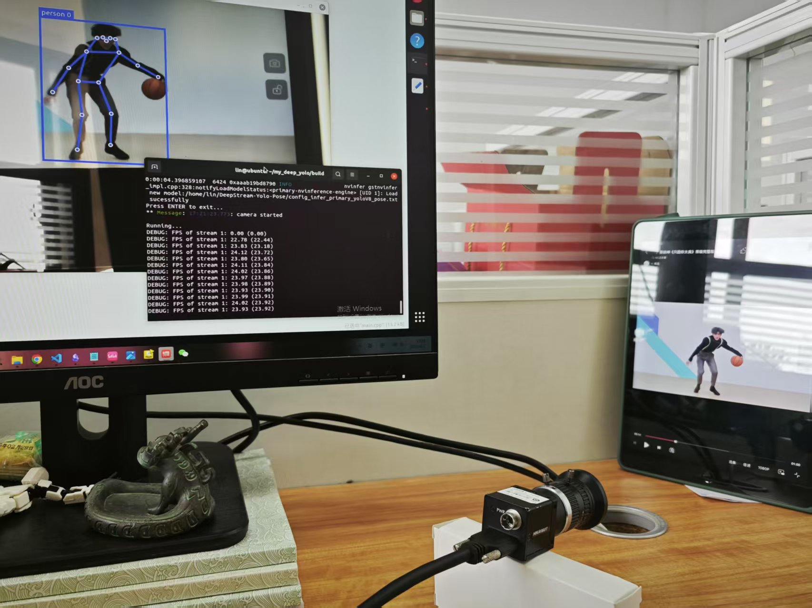

# 项目说明
本项目基于https://github.com/marcoslucianops/DeepStream-Yolo
此项目为添加海康摄像头进行管道验证
此项目已在jetson orin nx平台完成验证

# 实现功能
1. 从文件读取视频进行姿态识别任务；
2. 从csi采集图像进行姿态识别任务；
3. 可实时渲染显示识别结果视频，也可将识别结果视频保存至文件内；
4. 获取关键点数据，保存至.csv文件内，可用于其他后处理任务；

# 使用方法
1. 克隆本仓库
```shell
git clone https://github.com/zcliln615/my-deepstream-yolo-base.git
```
2. 修改部分参数
在main.cpp中修改部分参数以适应开发需求
+ 修改配置文件路径
 ```cpp
 #define CONFIG_FILE_PATH "${文件路径}/config_infer_primary_yoloV8_pose.txt"
 ```
+ 视频读取
 ```cpp
#define CAPTURE_MODE 0    // 1: 文件读取视频；0: csi摄像头读取视频
 #define VIDEO_PATH ""${文件路径}/bodypose.mp4" //更改为视频所在位置
 ```
 + 选择结果呈现方式
 ```cpp
 #define VIDEO_SAVE_MODE 0 // 0: 不保存视频,实时演示；1: 保存视频，不实时演示
 ```
3. 编译项目
```shell
mkdir build
cd build
cmake ..
make
```
4. 运行项目
确保在`build/bin`目录下
```shell
./my-deep-yolo
```
# 部分结果展示
## 视频读取


## 海康摄像机读取
>tips：本项目仅支持csi摄像头读入，海康相机需写驱动


